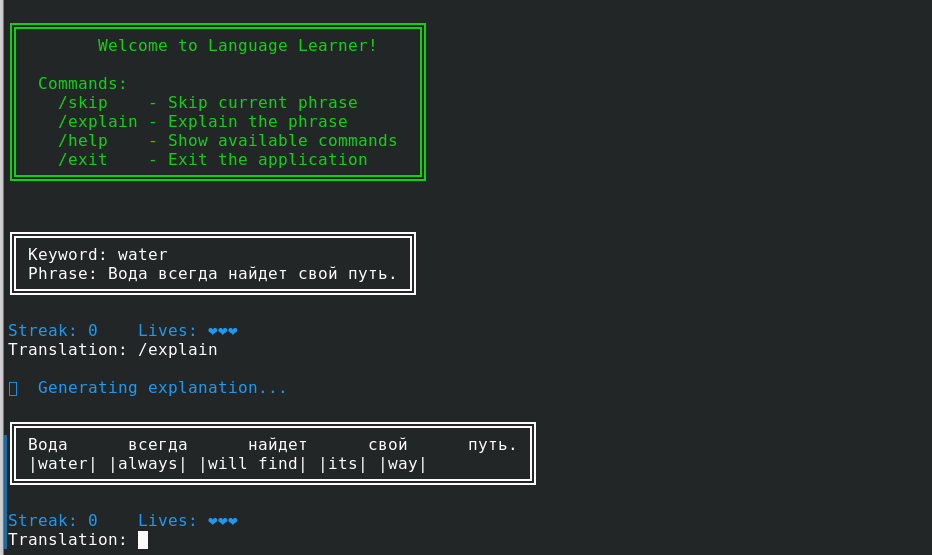

# Language Learner



Language Learner is a CLI-based tool designed to help users learn a new language through interactive phrase translation exercises. It generates learning material using the [Formulaic API](https://formulaic.app) and stores progress locally.

## Features

- **Dynamic Phrase Generation:** Generates language-learning phrases based on a structured formula.
- **AI-Powered Feedback:** Grades your translations with detailed AI feedback.
- **Progress Tracking:** Tracks learned words, current streak, and progress.
- **Game-Like Experience:**
  - **Streak Tracking:** Increase your streak by answering correctly.
  - **Lives System:** You start with a set number of lives (displayed as hearts) that decrease with incorrect answers.
- **Multi-Language Support:** Configure both your native and target languages.
- **Interactive CLI Commands:** Use slash commands like `/skip`, `/explain`, `/help`, and `/exit` for additional functionality.

## Prerequisites

Before setting up the project, ensure you have the following installed:

- [Node.js](https://nodejs.org) (v16 or later)
- [TypeScript](https://www.typescriptlang.org/) (installed via `npm install -g typescript`)
- A [Formulaic](https://formulaic.app) API key

## Installation

### 1. Clone the Repository

```sh
git clone https://github.com/yourusername/language-learner.git
cd language-learner
```

### 2. Install Dependencies

```sh
npm install
```

### 3. Configure the Application

The application requires a [Formulaic API](https://formulaic.app) key to generate phrases. You will be prompted to enter it on the first run.

Alternatively, you can manually create a config file:

```json
{
  "userLang": "en",
  "targetLang": "es",
  "schedule": 21600000,
  "apiKey": "your-formulaic-api-key",
  "formulaId": "",
  "dataFile": "./data/learned.json"
}
```

Save this file as `data/config.json`.

### 4. Run the Application

```sh
npm run start
```

This will start the language-learning session, where you'll be prompted with phrases and graded on your translations in a game-like environment.

## Usage

### Learning Session

- **Game Mechanics:**
  - At the beginning of each round, your current **streak** and remaining **lives** (displayed as hearts) are shown.
  - Answer correctly to increase your streak.
  - An incorrect answer resets your streak and reduces your lives. When lives reach zero, the game is over.
- **Commands:**  
  All commands must be prefixed with a slash (`/`):
  - `/skip` — Skip the current phrase and reset your streak.
  - `/explain` — Get a word-by-word explanation of the phrase in a visually formatted box.
  - `/help` — Show the list of available commands.
  - `/exit` — Exit the application.

### Translation Process

1. A phrase in the target language is presented inside a rectangular box along with the relevant keyword.
2. Type your translation and press Enter.
3. If correct, your streak increases and you proceed to the next phrase.
4. If incorrect, you receive feedback, lose a life, and get another chance to try.
5. Use slash commands anytime for additional help or options.

### Managing Data

All learned data is stored in `data/learned.json`. If needed, you can reset your progress by deleting this file.

## Development

### Running in Development Mode

To run in development mode:

```sh
npm run dev
```

### Running Tests

```sh
npm run test
```

## License

This project is licensed under the Mozilla Public License 2.0 (MPL-2.0). See [LICENSE](LICENSE) for details.
